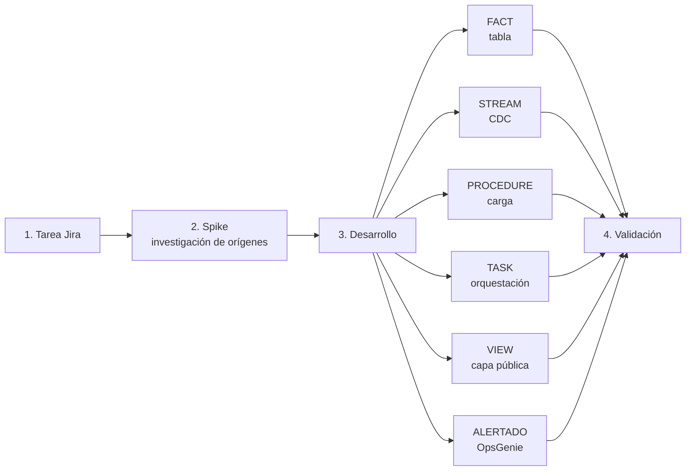
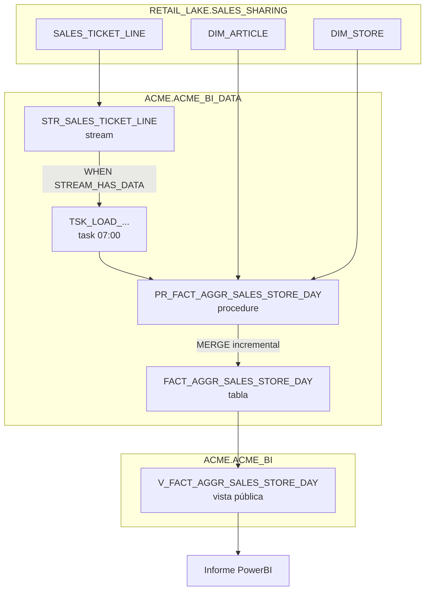

[README.md](https://github.com/user-attachments/files/32650995/README.md)
# Bootcamp de Datos — ACME_RETAIL

Ejercicio práctico y **autocontenido** para aprender el flujo de trabajo de un desarrollo BI sobre
**Snowflake**, tal y como se hace en un proyecto real, pero con **datos ficticios y anonimizados**.

> **Empresa ficticia:** ACME_RETAIL (retail de moda). Ningún dato, nombre de base de datos,
> esquema o tabla se corresponde con un sistema real. Todo es simulado para poder ejecutarse en
> cualquier cuenta de Snowflake sin acceso a producción.

---

## 1. El flujo de trabajo que vas a practicar

> **¿Nuevo en Snowflake o en proyectos de datos?** Empieza por
> [docs/00_conceptos_teoricos.md](docs/00_conceptos_teoricos.md): explica desde cero cada pieza
> (TASK, STREAM, PROCEDIMIENTO, VISTA, seguridad de fila…) y cómo se piensa una tarea de este tipo.

Un desarrollo típico del equipo BI sigue estas fases:



1. **Tarea Jira** — recibes qué se quiere obtener y a partir de qué datos → [docs/01_jira_ACMEBI-142.md](docs/01_jira_ACMEBI-142.md)
2. **Spike** — investigas los orígenes disponibles y decides el diseño → [docs/02_spike_ACMEBI-142.md](docs/02_spike_ACMEBI-142.md)
3. **Desarrollo** — implementas FACT, STREAM, PROCEDURE, TASK, VIEW y ALERTADO.
4. **Validación** — ejecutas de principio a fin y compruebas el resultado.

## 2. Arquitectura de datos

Cada capa vive en una base de datos / esquema distinto, igual que en un proyecto real:

| Capa | Ubicación | Contenido | Quién lo gestiona |
|------|-----------|-----------|-------------------|
| **Orígenes** | `RETAIL_LAKE.SALES_SHARING` | Datos compartidos por otros equipos (ventas, maestros) | *(mock)* Equipos origen |
| **BI — datos** | `ACME.ACME_BI_DATA` | Tablas FACT, procedimientos, tasks, streams | **Equipo BI (tú)** |
| **BI — vistas** | `ACME.ACME_BI` | Vistas públicas para PowerBI (con seguridad) | **Equipo BI (tú)** |
| **Plataforma** | `PLATFORM.GOVERNANCE` | Log de ETL, tags de sensibilidad, control de accesos | *(mock)* Plataforma |



## 3. Estructura del repositorio del bootcamp

```
bootcamp/
├── README.md                         ← este fichero
├── docs/
│   ├── 00_conceptos_teoricos.md      ← teoría de base (léelo primero: TASK, STREAM, VISTA, etc.)
│   ├── 01_jira_ACMEBI-142.md         ← enunciado de la tarea
│   ├── 02_spike_ACMEBI-142.md        ← ejemplo de documento de Spike
│   └── 03_guia_instructor.md         ← guía del formador + rúbrica (uso interno)
├── setup/                            ← preparación del entorno (ejecutar en orden)
│   ├── 00_databases_and_warehouse.sql
│   ├── 01_governance.sql
│   ├── 02_mock_sources.sql
│   └── 03_generate_sales.sql         ← ventas: se ejecuta DESPUÉS de crear el stream
├── starter/                         ← esqueletos con TODO para que los completes
│   ├── user_data/ACME_BI_DATA/SALES/...
│   ├── user_data/ACME_BI/SALES/...
│   └── config/alert_queries/SALES/...
└── solution/                        ← solución de referencia (no mirar antes de intentarlo)
    ├── user_data/ACME_BI_DATA/SALES/...
    ├── user_data/ACME_BI/SALES/...
    └── config/alert_queries/SALES/...
```

> La separación `user_data/` (objetos de base de datos) y `config/` (alertas, checks) replica la
> estructura del repositorio real, que se despliega automáticamente mediante un pipeline de CI/CD.

## 4. Puesta en marcha

**Requisitos:** una cuenta de Snowflake y un rol con permisos para crear bases de datos y
warehouses (p.ej. `SYSADMIN` o `ACCOUNTADMIN`).

El orden completo del ejercicio es:

1. `setup/00_databases_and_warehouse.sql` — crea bases de datos, esquemas y warehouse.
2. `setup/01_governance.sql` — crea el log de ETL, el tag (opcional) y el control de accesos (mock).
3. `setup/02_mock_sources.sql` — crea los orígenes: **maestros con datos** y la tabla de ventas **vacía**.
4. **Desarrollo**: despliega tus objetos (tabla, **stream**, procedimiento, task, vista, alerta).
5. `setup/03_generate_sales.sql` — **simula la llegada de ventas** al lake. Se ejecuta AQUÍ, después
   del stream, para que este capture las ventas (un stream solo ve los cambios posteriores a su
   creación). Ejecutarlo antes dejaría el stream vacío: es un concepto clave.
6. **Validación** (sección 6).

> En Snowsight/DBeaver, copia y pega el contenido de cada fichero y ejecútalo completo antes del
> siguiente.

## 5. Tu tarea

1. Lee el enunciado: [docs/01_jira_ACMEBI-142.md](docs/01_jira_ACMEBI-142.md).
2. Escribe (o revisa) el Spike: [docs/02_spike_ACMEBI-142.md](docs/02_spike_ACMEBI-142.md).
3. Completa los ficheros de `starter/` en este orden:
   1. `FACT_AGGR_SALES_STORE_DAY.sql` (tabla)
   2. `STR_SALES_TICKET_LINE.sql` (stream)
   3. `PR_FACT_AGGR_SALES_STORE_DAY.sql` (procedimiento)
   4. `TSK_LOAD_FACT_AGGR_SALES_STORE_DAY.sql` (task)
   5. `V_FACT_AGGR_SALES_STORE_DAY.sql` (vista)
   6. `ALERT_SALES_STORE_DAY_CARGA.sql` + `config_opsgenie_SALES.yaml` (alertado)
4. Ejecuta `setup/03_generate_sales.sql` para simular la llegada de ventas (el stream las capturará).
5. Valida el resultado (ver sección 6).

## 6. Validación rápida

Con las ventas ya generadas (paso 5, `03_generate_sales.sql`), ejecuta la carga y comprueba:

```sql
-- 1) ¿El stream ha capturado las ventas nuevas?
SELECT SYSTEM$STREAM_HAS_DATA('ACME.ACME_BI_DATA.STR_SALES_TICKET_LINE');  -- TRUE

-- 2) Ejecuta la carga a mano (equivale a lo que hará la task):
CALL ACME.ACME_BI_DATA.PR_FACT_AGGR_SALES_STORE_DAY();

-- 3) El stream queda consumido:
SELECT SYSTEM$STREAM_HAS_DATA('ACME.ACME_BI_DATA.STR_SALES_TICKET_LINE');  -- FALSE

-- 4) Resultado por la vista pública (debe coincidir con la tabla esperada de 03_generate_sales.sql):
SELECT * FROM ACME.ACME_BI.V_FACT_AGGR_SALES_STORE_DAY ORDER BY ID_DATE, ID_STORE, ID_SECTION;

-- 5) Rastro de la ejecución en el log de ETL:
SELECT * FROM PLATFORM.GOVERNANCE.ETL_EVENT_LOG ORDER BY EVENT_ID DESC;
```

**Debes comprobar que:**
- El resultado coincide con la **tabla de valores esperados** de `setup/03_generate_sales.sql`.
- La tienda **1005 (cerrada) no aparece** en el resultado.
- `NET_AMOUNT` = `GROSS_AMOUNT - DISCOUNT_AMOUNT`.
- El stream queda **consumido** tras la carga (pasa a `FALSE`).
- El log `ETL_EVENT_LOG` registra la ejecución con estado `SUCCESS`.

> **Prueba extra (carga incremental).** Inserta otra venta y vuelve a lanzar la carga: el stream se
> reactiva y la FACT **suma** el nuevo dato solo en esa combinación.
> ```sql
> INSERT INTO RETAIL_LAKE.SALES_SHARING.SALES_TICKET_LINE
>     (ID_TICKET, ID_TICKET_LINE, ID_STORE, ID_ARTICLE, SALE_DATE, SOLD_UNITS, GROSS_AMOUNT, DISCOUNT_AMOUNT)
> VALUES (900010, 1, 1001, 5001, '2026-06-03', 1, 19.95, 0.00);
> CALL ACME.ACME_BI_DATA.PR_FACT_AGGR_SALES_STORE_DAY();
> ```

## 7. Compatibilidad con tu cuenta trial (qué es real y qué es teórico)

Este bootcamp está pensado para condiciones de **laboratorio**: una cuenta **trial de Snowflake**
(posiblemente Standard Edition), GitHub y DBeaver. No hay infraestructura de empresa. Por eso hemos
diseñado el ejercicio para que **todo lo obligatorio sea ejecutable** y hemos marcado como *teoría*
lo que requiere features Enterprise o infra externa:

| Concepto | ¿Ejecutable en tu trial? | Cómo lo tratamos |
|----------|:------------------------:|------------------|
| Tablas `TRANSIENT`, `DIM`/`FACT` | ✅ Sí | Se crean y consultan con normalidad |
| `STREAM` + `CHANGE_TRACKING` | ✅ Sí | Se crea, se consume y se comprueba con `SYSTEM$STREAM_HAS_DATA` |
| `TASK` (CRON, `WHEN`, relanzada) | ✅ Sí (rol `ACCOUNTADMIN`) | Se crea y `RESUME`; para probar sin esperar al CRON, usa `EXECUTE TASK` |
| `PROCEDURE` + log ETL + `MERGE` | ✅ Sí | Se ejecuta con `CALL` |
| Seguridad a nivel de fila | ⚠️ **Simulada** | En vez de una *Row Access Policy* (Enterprise), se simula con una vista de entitlements + `JOIN`. Es SQL estándar: **sí se prueba** |
| Tags de sensibilidad | ❌ Solo Enterprise | Van **comentados**. Son teoría de gobierno del dato; descomenta solo si tu cuenta es Enterprise |
| Entrega de alerta a **OpsGenie** | ❌ Requiere pipeline/infra | **Teoría**. Lo accionable es la **regla SQL**: la ejecutas a mano y ves si "dispararía" la alerta |
| Despliegue por pipeline (Azure DevOps) | ❌ No hay pipeline | En el lab ejecutas el SQL a mano en DBeaver; el pipeline se explica como concepto |

> En resumen: **nada de lo que tienes que entregar depende de Enterprise ni de infra**. Los tags y la
> entrega a OpsGenie son "extras" conceptuales; el resto lo pruebas de verdad.

## 8. Glosario

- **FACT**: tabla de hechos con métricas agregadas a una granularidad concreta.
- **STREAM**: objeto de *Change Data Capture* (CDC) que registra los cambios de una tabla.
- **TASK**: objeto que ejecuta SQL de forma programada (CRON) o encadenada.
- **`SYSTEM$STREAM_HAS_DATA`**: función que indica si un stream tiene cambios pendientes; se usa en
  la cláusula `WHEN` de una task para no ejecutarla si no hay datos nuevos.
- **Row Access / seguridad a nivel de fila**: mecanismo por el que cada usuario solo ve las filas
  a las que su rol tiene acceso.
- **OpsGenie**: herramienta de gestión de alertas/guardias donde se notifican los fallos de carga.
